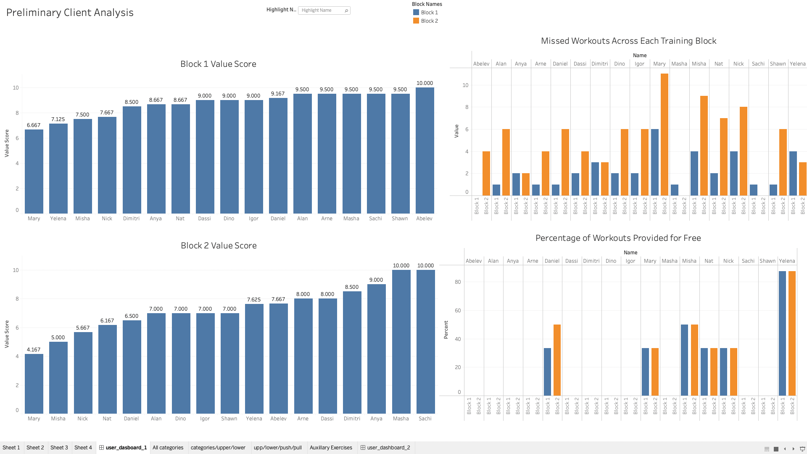
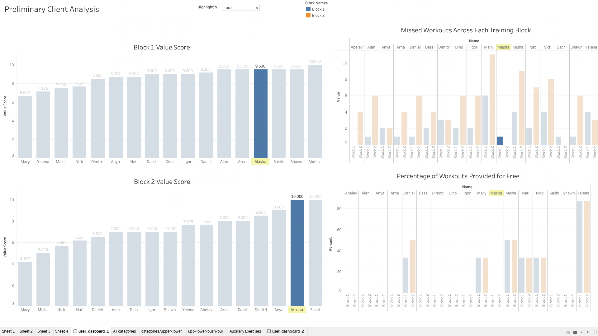
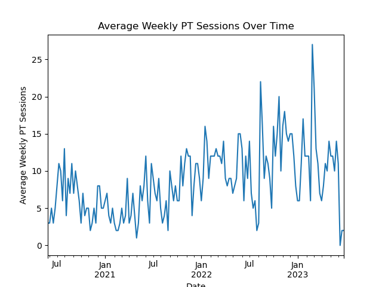
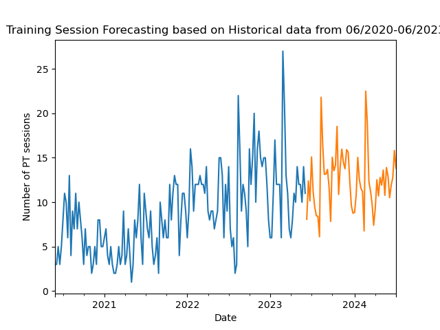
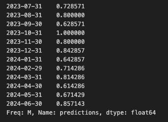
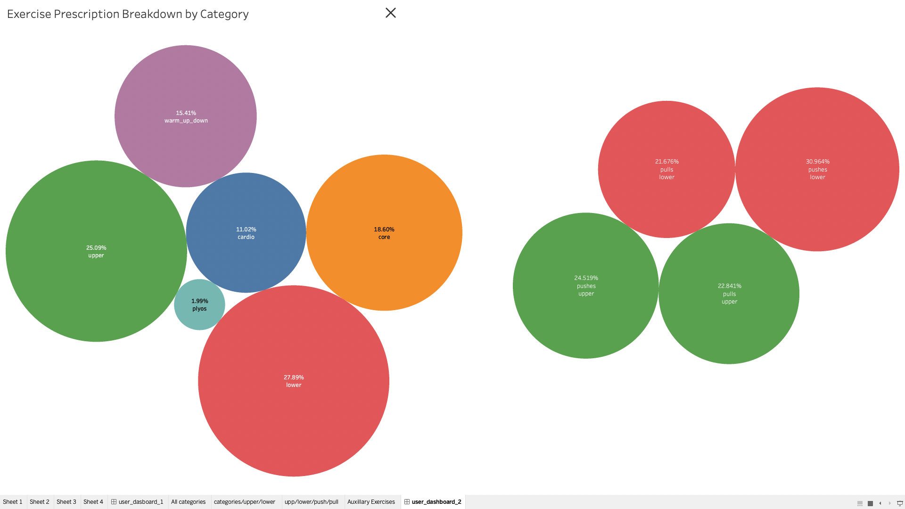
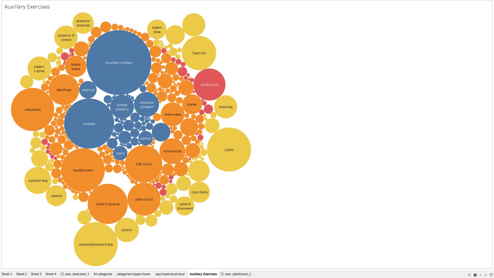

# JP-HPC-Data-Analysis using PostgreSQL, Python, and Tableau (In Progress)

In this project, I utilized PostgreSQL, Python, and Tableau to perform data analysis and visualization for my fitness business. The analysis was designed to identify crucial business and user metrics to aid decision-making and strategic planning.

## Project Overview

The project included the following steps:

1. **Data Extraction:** Utilizing my personal developed PostgreSQL Google Cloud instance, data was pulled from the database which contained details of all client workouts, including exercises prescribed, volume loads achieved, sessions attended and skipped, and periods of injury.

2. **Data Preparation:** Python, particularly the pandas library, was used to clean and manipulate the data into a format suitable for analysis. This step included identifying missing values, correcting data types, and aggregating data as needed.

3. **Data Analysis:** The cleaned and prepared data was then analyzed to answer key business questions, such as the value of each individual client, potential revenue losses due to free training sessions, and seasonal changes in business. User metrics were also analyzed, including the frequency of prescribed exercises, most skipped exercises, highest achieved volume loads, average workout skips per block, changes in volume load over time, and volume load before periods of injury.

4. **Data Export:** The analyzed data was exported as .csv files, which were then ready for visualization in Tableau.

5. **Data Visualization:** Tableau was used to create clear and interactive dashboards displaying the results of the analysis. These dashboards were designed to be easily understood by key stakeholders for informed decision-making.

## Key Findings

The following insights were gained from this project:

- **Business Metrics:**
  - Each client's value was assessed based on their attendance, workouts completed, and services provided for free.
  - Potential revenue losses were identified due to complimentary training sessions.
   
   

  - Integrated calendar data into Python via iCalendar for forecasting analysis
  - Seasonal changes were forecasted based on trends in client activity and business performance
  

  - SARIMA forecasting model predicts dips and peaks in business traffic based on previous calendar data
  - Both avergae weekly session count and monthly percent of max sessions can be calculated
    
      
   

- **User Analysis:**
  - The most frequently prescribed exercises were identified to evaluate program diversity and identify areas for variation.
  - The most commonly skipped exercises were pinpointed, providing insights into possible areas for client motivation or program adjustment.
       
      

  - An average number of workout skips per block was established, offering a baseline for measuring client commitment and identifying areas for improvement.
  - Clients achieving the highest volume loads were recognized, providing potential testimonials or case studies.
  - Changes in volume load over time were charted to evaluate program effectiveness.
  - Volume load prior to injury periods was analyzed to identify potential risk factors and aid in program safety.

- **Future Analysis:**
  - Assess greatest changes in Volume Load over time and highest volume load amongst users
  - Assess prescription differences across genders
  - Develop a full Dash/Streamlit dashboard with Tableau User Analysis and Business Analysis Integrated and ability to see how forecasting changes as model looks further into the future
  

## Concluding Remarks

This project highlighted the importance of data analysis in personal small business management, demonstrating how strategic insights can be gleaned from client and workout data. Using Python for data preparation and analysis, along with Tableau for data visualization, offers a powerful toolset for any business in the fitness industry.
